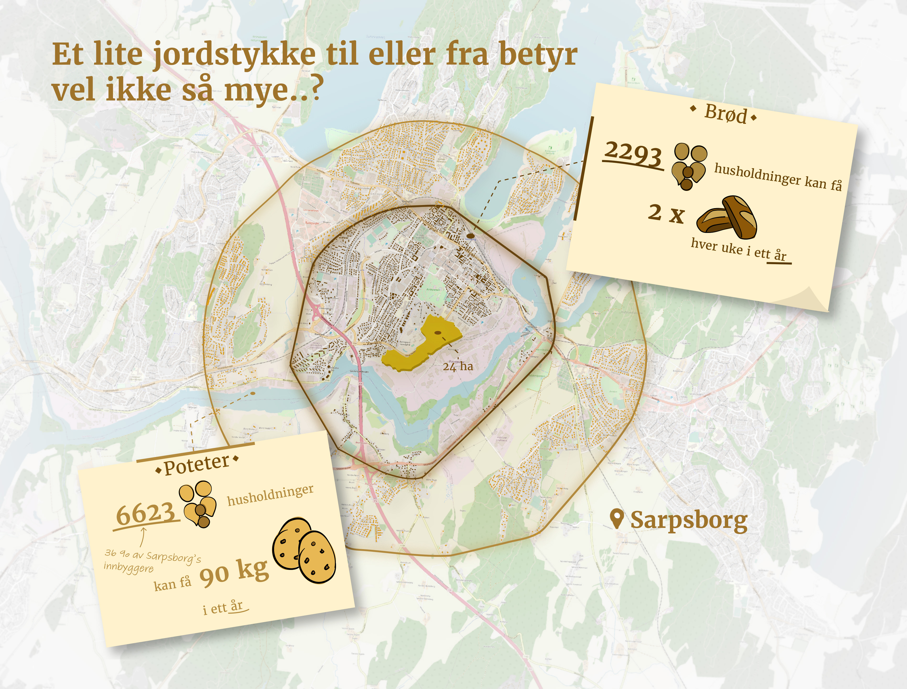

# How many households could be fed by one agricultural parcel? 

What happens if there is a war and people are depended on their local food? Theoratically speaking, for how many households would one field, in this case [this field](https://kilden.nibio.no/?topic=arealinformasjon&zoom=11.5&x=6577018.47&y=278359.75&bgLayer=graatone&komnr=3003&layers=ar50_jordbruksareal&layers_opacity=0.75&layers_visibility=true),  offer food for others. I looked at potatoes and loafs of bread for this project.


The goal of this project is to visualise how many households could be fed with potatoes or loafs of bread using only one field in Sarpsborg. 

The following datasets have been used: 
- Matrikkelen: Bygningspunkt - [source](https://kartkatalog.geonorge.no/metadata/matrikkelen-bygningspunkt/24d7e9d1-87f6-45a0-b38e-3447f8d7f9a1) - points of the type of building, use of building etc.
- Clip of Byggning data 
- AR50 data - [source](https://register.geonorge.no/geodatalov-statusregister/arealressurskart-ar50-jordbruk/76255ebe-2a0e-401e-87c8-7618dd196cf2) - polygon data of the agricultural field

<br>

First, I made a PostGIS container from Docker.
```
docker run --name postgis -d -p 5432:5432 -e POSTGRES_PASSWORD=postgres postgis/postgis
```

Afterwards, I created a database with a `postgis` extension. 
```
$ docker exec -it postgis psql -U postgres
$ postgres=# create database geonorge;
$ postgres=# create extension postgis;
$ postgres=# create scheme nibio;
$ postgres=# \q
```
Then I downloaded the Matrikkelen data using `wget` and add the data in the database.
```
$ wget https://nedlasting.geonorge.no/geonorge/Basisdata/MatrikkelenBygning/SOSI/Basisdata_30_Viken_25832_MatrikkelenBygning_SOSI.zip

$ unzip Basisdata_30_Viken_25832_MatrikkelenBygning_PostGIS.zip

$ docker cp Basisdata_30_Viken_25832_MatrikkelenBygning_PostGIS.sql postgis:/opt/

$ docker exec -it postgis psql -U postgres -d geonorge

$ geonorge=# \i /opt/Basisdata_30_Viken_25832_MatrikkelenBygning_PostGIS.sql

```
The resulting tables are combined and filtered by `naringsgruppe = 'X'` (housing). The agricultural field is extracted from the WFS using QGIS and added to the database.

The geometry of the buildings have been send by NIBIO. These shapes are also added to the database using `ogr2ogr`. 
```
$ ogr2ogr -f PostgreSQL PG:"dbname='geonorge' host='localhost' port='5432' user='postgres' password='postgres'" -lco SCHEMA=nibio \ clip.shp -nln 'clipped_buildings' -nlt PROMOTE_TO_MULTI -lco PRECISION=no
``` 

Using PostGIS the bygning (points) are spatially joined with the buildings (polygons) with `ST_CONTAINS`. In [this spreadsheet](https://docs.google.com/spreadsheets/d/1HYZaOXhNnD-EmKDzhgBM7aYWnulwUnf-5vBIyKuBD68/edit?usp=sharing) it is calculated how many households could be fed by this one agricultural field. I want to select the closest buildings that could be fed by the field. To achieve that, I used the `ST_DISTANCE` function and limited the amount of rows based on the results of the spreadsheet. 

These were **2293 households** for two loafes of bread each week for one year or  **6623 households** that would be eating potatoes for a whole year.

The spreadsheet uses the following sources:
- [How many potatoes does a person eat in a year?](https://www.nrk.no/nyheter/potetforbruket-halvert-pa-25-ar-1.16043617)
- [How many potatoes grow on a square meter?](https://nibio.brage.unit.no/nibio-xmlui/handle/11250/3083497)
- [How many loafs of bread grow on a square meter](https://jordvern.no/1-kvadratmeter-1-brod/)

The resulting map is exported from QGIS to PDF and further edited in Adobe Illustrator and Photoshop, resulting in the infographic below.

